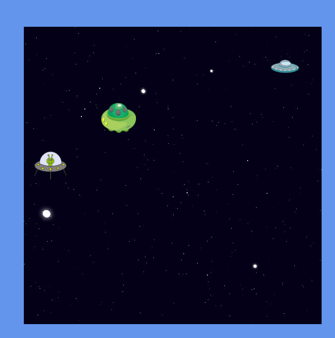

# 🕹 Jogo Space Shooter da DIO
> Criando o Jogo Space Shooter JavaScript/CSS

## 📋 Índice
- [Link do projeto:](https://finandolopes.github.io/Space-Shooter-DIO/)

- [📖 Sobre](#-Sobre)
- [🚀 Tecnologias utilizadas](#-Tecnologias-utilizadas)
- [🖥 Preview](#-Preview)
- [📌 Créditos](#-Créditos)

## 📖 Sobre
 - Jogo Space Shooter - Atividade da DIO

## 🚀 Tecnologias utilizadas
- `Javascript`
- `HTML`
- `CSS`

## 🖥 Preview:

  

   

